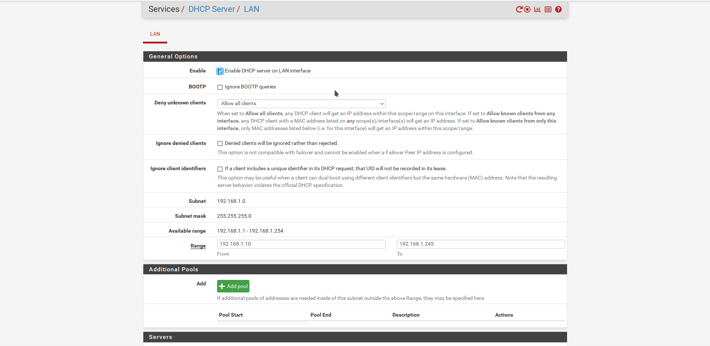

Quentin Demontoux, Malory Bergez-Casalou et Léa Duvigneau

# HelloMouïse.com

## Kesako ?

Notre projet c'est un exemple type d'une infrastructure d'une petite entreprise. On utilise diverses technologies : PFsense, active Directory, DHCP, GNS3, OpenVPN.

Pourquoi ce nom ? 


## Tour de quentin

Utilisation d’une tour sous windows 10 en guise de serveur VPN et d’hote pour le projet. Malheuresement des problemes de routing sur windows ont empeché le bon deroulement du projet.

### OpenVPN

Utilisation de OpenVPN pour le VPN voici le fichier de conf server: 

```
port 1194
proto udp
dev tun
ca ca.crt
cert server.crt
key server.key
dh dh.pem
server 10.50.5.0 255.255.255.0
ifconfig-pool-persist ipp.txt
keepalive 10 120
comp-lzo
persist-key
persist-tun
status openvpn-status.log
verb 3
push "redirect-gateway local def1"
push "redirect-gateway def1 bypass-dhcp"
push "dhcp-option DNS 8.8.8.8"
push "dhcp-option DNS 8.8.4.4"
push "route 192.168.172.0 255.255.255.0"
topology subnet
```


## Active Directory

Mise en place d’un AD sur windows server 2019 et d’un DNS obligatoire


## GNS3

GNS3, quel bonheur ! GNS3 permet de émuler, configurer, tester et dépanner des réseaux virtuels et réels. Il autorise le lancement de petites topologies.

Le GNS3 est constitué de deux composants logiciels :

- Le logiciel all-in-one GNS3 (GUI)
- La machine virtuelle GNS3 (VM)

Le logiciel GNS3 all-in-one :
Il s'agit de la partie client de GNS3 et de l'interface utilisateur graphique (GUI). Vous installez le logiciel all-in-one sur votre PC local (Windows, MAC, Linux) et créez vos topologies à l'aide de ce logiciel. 

Options du serveur :
Lorsque vous créez des topologies dans GNS3 à l'aide du client GUI du logiciel all-in-one, les dispositifs créés doivent être hébergés et exécutés par un processus serveur. Quelques options pour la partie serveur du logiciel :

- Serveur GNS3 local
- VM locale GNS3
- VM GNS3 distante

### Télécharger GNS3

Here, un lien pour télécharger GNS3 : https://www.gns3.com/software/download

N'oubliez pas d'autoriser root uBridge. Ceci est requis pour permettre à GNS3 d'accéder à votre réseau.

### Configurez ensuite wizard with the GNS3 VM :

Importez GNS3 VM dans VMware Workstation. Vous pouvez aussi utiliser VirtualBox ou HyperV. 
Extraire l'archive .zip téléchargée précédemment.
Dans VMware Workstation, cliquez sur  **'Open a Virtual Machine'**.
Rendez-vous dans le dossier où a été extrait **GNS3 VM.ova** , et cliquez **'Open'**.
Nommez la machine virtuelle **'GNS3 VM'**, et cliquez sur **'Import'**.

Démarrez GNS3 et sélectionnez **'Run Modern IOS (IOSv or IOU), ASA, and appliances from non-Cisco manufacturers'** dans le Wizard et cliquez sur **'Next'**.

Assurez-vous que le chemin vers la GNS3 server est correcte, et selectionnez un Host binding et un port. Selectionnez le 127.0.0.1 local loopback address. Cliquez sur **'Next'**.

### Import appliance

Rendez-vous sur https://www.gns3.com/marketplace/appliances/pfsense et sur https://gns3.com/marketplace/appliances/cisco-iou-l3 pour télécharger l'iso du PFSense et du CISCO IOU.

Dans l'interface utilisateur de GNS3, cliquez sur **File** puis **Import appliance**.
Naviguez dans votre dossier **Downloads**, selectionnez l'appliance et cliquez sur **Open**. Suivez les instructions et importez les fichiers requis. 

### PFsense

pfSense est un logiciel libre et open source provenant du système d'exploitation FreeBSD. Il est spécialement concu pour etre utilisé comme un pare-feu et un router gérable via une interface Web.

Rendez-vous sur https://www.pfsense.org/download/ pour télécharger l'image de pfSense.

Depuis votre hyperviseur, comme virtualBox ou VMWare, créer une nouvelle machine virtuelle  de type BSD version FreeBSD 64 bit. Ajouter à cette machine, un disque contenant l'image du pfSense.
Démarrez votre VM, installer pfSense puis reboot le système. Une fois configuré, vous pouvez retirer le disque précédemment ajouté.

Rendez-vous de nouveau sur GNS3, et importer dans **préférence**, **virtualBox VM** (ou VMWare VM) votre VM pfSense.

Autorisez **Allow GNS3 to use any configured VirtualBox/VMWare adapter** 

### Infrastructure GNS3

Reproduisez l'infrastructure comme suit :


#### Setup vlans et switch

##### Acces mode configuration des switchs 

```
enable 
configure terminal
```

##### Création VLAN

```
vlan 100
name MGMT
```

##### Configuration d'une adresse IP de management sur un switch

```
En mode de configuration :
    interface vlan 100
    ip address 10.0.100.2 255.255.255.0
    no shutdown
    exit
```

##### Configuration des vlans sur les interfaces

###### Interface type Interco-Switchs ou Interco Switchs/Routeurs

```
En mode de configuration :
    interface fa0/4
    switchport mode trunk
    switchport trunk allowed vlan all
    no shutdown
```

###### Interface type PC

```
En mode de configuration :
    interface fa0/1
    switchport mode access
    switchport access vlan 10
    no shutdown
```

##### Enregistrement de la configuration

```
En mode enable : (sortir du mode configuration grace à la commande exit)
copy running-config startup-config
ou
write memory
Petite astuce, si vous souhaitez rester en mode de configuration, ajoutez la commande "do" devant :
do copy running-config
ou
do write memory
```

##### Show run

Voici une vue de notre configuration :

```
interface Ethernet0/0
 switchport trunk encapsulation dot1q
 switchport mode trunk
 duplex auto
!
interface Ethernet1/0
 switchport access vlan 10
 switchport mode access
 duplex auto
!
interface Ethernet1/1
 switchport access vlan 10
 switchport mode access
 duplex auto
!
interface Ethernet2/0
 switchport access vlan 20
 switchport mode access
 duplex auto
!
interface Ethernet2/1
 switchport access vlan 20
 switchport mode access
 duplex auto
! 
```

####Configuration du pfsense

Démarrez et configurez le WAN en DHCP sur em0.



